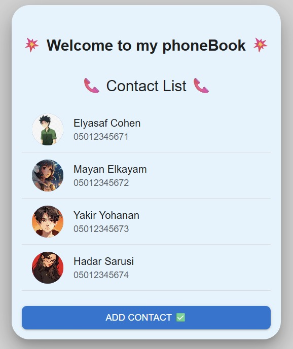
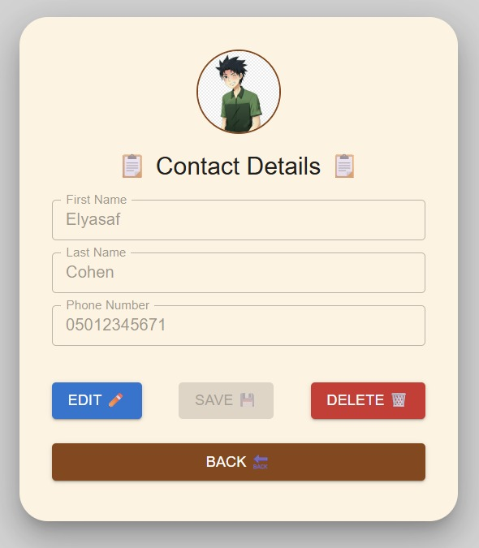
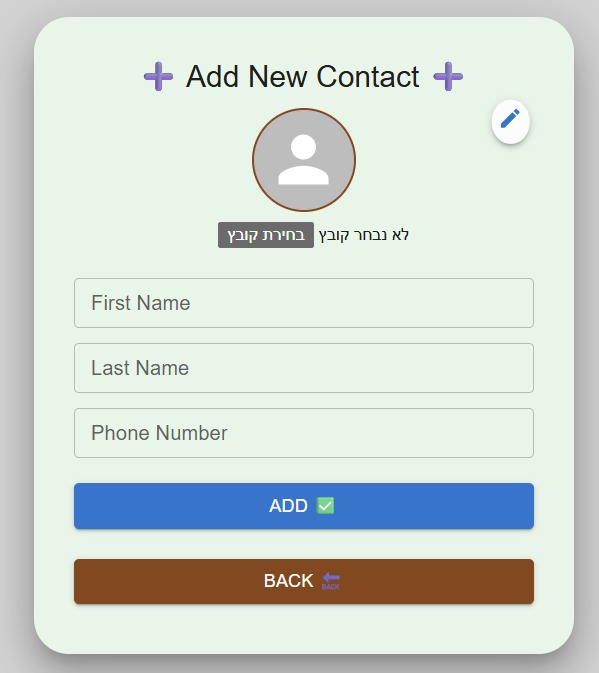

# 📞 React PhoneBook App – Smart & Stylish! 💻

A beautifully designed **PhoneBook Manager App** built with **React + Vite + MUI (Material UI)**, combining simplicity, clarity and a smooth user experience.  
Create, edit, and view your contacts easily – all in a clean and intuitive interface! ✨✨

---

## 🖼️ App Screenshots 🖼️

### 🌟 Main Screen – Contact List 🌟


### 📋 Contact Details View 📋


### ➕ Add New Contact ➕


---

## 🎯 Features 🎯

- 👨‍👩‍👧 Add new contacts (name, phone, image, group)
- 🖊️ Edit contact details with live form validation
- 🗑️ Delete contact with confirmation
- 🔍 View contact info in a modern detailed card
- 🎨 Fully styled with **Material UI (MUI)**
- 🪄 Slick design with animations and color themes

---

## 🧑‍💻 Technologies Used 🧑‍💻

- ⚛️ React + Vite  
- 💠 **Material UI (MUI)** for design & components  
- 👨‍🎨 CSS3 Styling  
- 📦 Simple component structure  

---

## 📁 Folder Structure

```
📁 src/
├── 📂 components/
│   ├── AddContact.jsx
│   ├── ContactDetails.jsx
│   ├── ContactList.jsx
├── 📂 assets/
│   └── profile-icons, backgrounds...
├── App.jsx
├── main.jsx
```

---

## ▶️ Getting Started

1. Clone the repo:
```bash
git clone https://github.com/YourUsername/React-PhoneBook-App.git
```

2. Install dependencies:
```bash
npm install
```

3. Start the development server:
```bash
npm run dev
```

---

## 🚀 Demo 🚀

> You can view a live demo [here](https://your-deployment-url.com)  
> (replace with real deployment if you have one! 🥳)

---

## 🎉 Built with good vibes and a big smile – by: 🎉

**Elyasaf Cohen** 👊😎
 
GitHub: [@ElyasafCohen100](https://github.com/ElyasafCohen100)

---

⭐ If you like this project – please leave a star! ⭐
